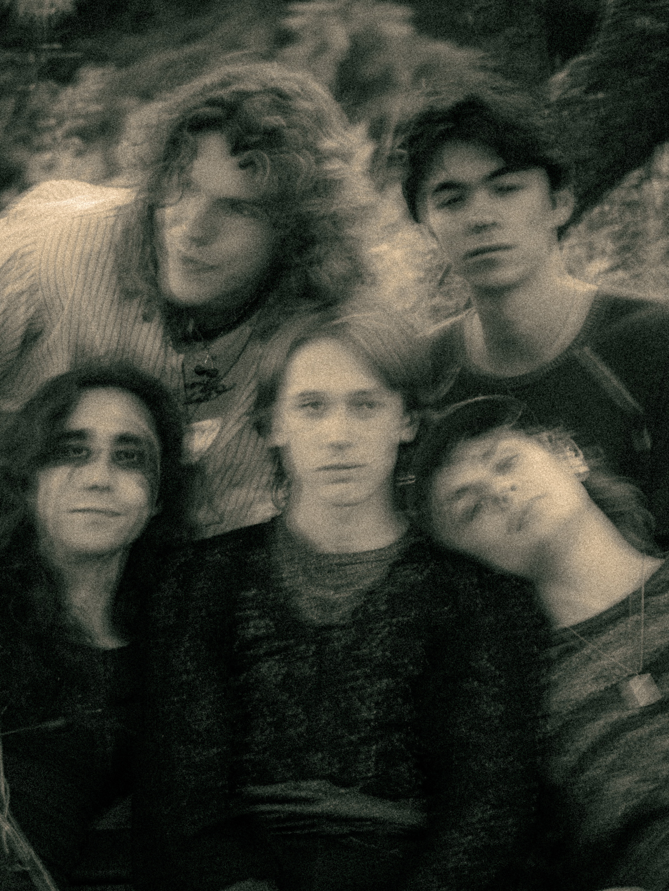

<!-- TODO: replace with Eric's real bio. Plain Markdown: blank lines between paragraphs, *italics*, **bold**, [links](https://example.com). -->

<!--  -->

Eric Folino is an up and coming singer-songwriter based in Waterloo, Canada. His catchy, and sometimes quirky songs are driven by upbeat grooves, blended with articulate and playful lyrics. Eric's sound is an alternative one inspired by classic British pop, where Eric delves into themes of personal growth and evolution.
